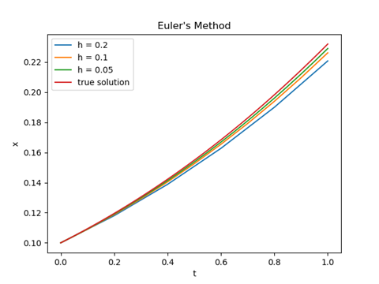
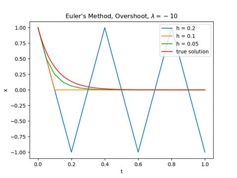
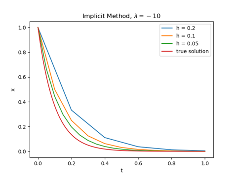
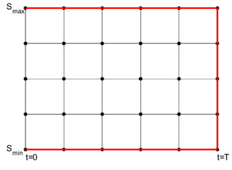
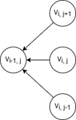
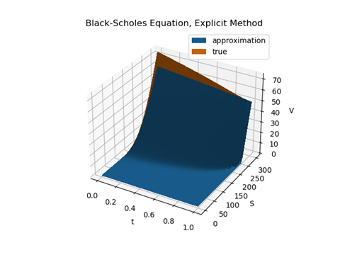
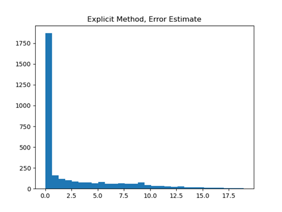
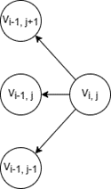
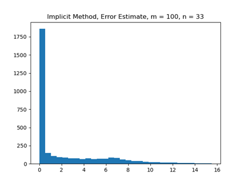
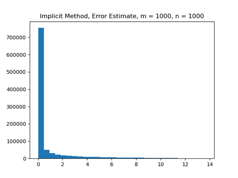

# Numerical Methods in Black-Scholes Equation

## Table of Contents

- [I. Introduction](#i-introduction)
- [II. Preliminaries](#ii-preliminaries)
- [III. Numerical Solution to ODE](iii-numerical-solution-to-ode)
- [IV. Numerical Solution to Black-Scholes Equation](#iv-numerical-solution-to-black-scholes-equation)
- [V. Conclusion](#v-conclusion)
- [VI. References](#vi-references)

## I. Introduction

Numerical methods are widely used in quantitative finance. For example, the Monte Carlo method is used for option pricing and net present value (NPV) analysis;
numerical optimization techniques can be deployed into portfolio management. Another significant result in quantitative finance regarding European option pricing is the Black-Scholes model,
which depicts the fair price of an option. In this article, I will introduce some basic numerical methodologies for solving differential equations and analyze the numerical solutions of the Black-Scholes Equation.

## II. Preliminaries

### 1. Analytic Solution to Ordinary Differential Equations

The general ODE formulation is as follows: We want to find the function $x:\mathbb{R}^n \to \mathbb{R}^n$ that satisfies the following equation:

$$
x'(t) = f(t, x(t)), x(0) = a
$$

For example, one can check that the solution to the logistic equation

$$
x'(t) = x(t)(1 - x(t)), x(0) = a \in (0, 1)
$$

is of the following form:

$$
x(t) = \frac{ae^t}{1 - a + ae^t}, t \geq 0
$$

The derivation is from separation of variables: One can divide both sides by the right-hand side and get

$$
\frac{dx}{x(1-x)} = dt
$$

and integration on both sides, with the given initial condition, can achieve the final solution. However, there is not always an analytic solution to an ODE: either because there is no closed form (e.g., the solution includes an integral sign) or because the ODE is too complex to be separable or solved using known tricks. Hence numerical algorithms play a role in deriving numerical solution that is enough for specific purposes. There are two main classifications: explicit and implicit methods, which I will discuss in the following sections.

### 2. Finite Difference Method

To estimate the derivative, the finite difference method is often used. For the first order derivative, there are three common types (with error estimate):

1. Forward Difference: $f'(x) = \frac{f(x+h) - f(x)}{h} + \mathcal{O}(h)$

2. Backward Difference: $f'(x) = \frac{f(x) - f(x-h)}{h} + \mathcal{O}(h)$

3. Central Difference: $f'(x) = \frac{f(x+h) - f(x-h)}{2h} + \mathcal{O}(h^2)$

The error estimates are derived from Taylor expansion. I will derive formula for central difference and the other two are obvious from the expansion expression:

$$
f(x+h) = f(x) + f'(x)h + \frac{1}{2}f''(x)h^2 + \frac{1}{6}f'''(\xi_1)h^3 \\
f(x-h) = f(x) + f'(x)(-h) + \frac{1}{2}f''(x)(-h)^2 + \frac{1}{6}f'''(\xi_2)(-h)^3
$$

Hence the approximation is

$$
\frac{f(x+h) - f(x-h)}{2h} = f'(x)+\frac{1}{12}(f'''(\xi_1) + f'''(\xi_2))h^2
$$

as desired (given enough smoothness of $f$).

For second order derivative, one can derive

$$
f''(x) = \frac{f(x+h) - 2f(x)+f(x-h)}{h^2} + \mathcal{O}(h^2)
$$

which can also be derived from Taylor expansion of $f(x+h)$ and $f(x-h)$. For higher derivatives, one can refer to Theorem 7.1.5 in Dahlquist and Björck [1] for details.

## III. Numerical Solution to ODE

### 1. Explicit Method

The simplest algorithm is called Euler’s method, which is the following:

- $x_0 = a, h = \frac{t}{k}$
- for $i = 1, 2, \dots, k$
  - $x_i = x_{i-1} + f(t_{i-1}, x_{i-1})h$

This algorithm computes the value of the solution from $0$ to $t$. The intuitive way of understanding the algorithm is that when the time is partitioned finely enough, one can regard the solution on each segment as a straight line whose slope can be represented by the derivative on the endpoint. For rigorous proof of this algorithm, one can resort to the proof of the Cauchy-Peano Theorem (the existence of the solution to certain ODEs), where the constructive answer is given through Euler’s method.

8One can estimate the error that in each step by Taylor expansion, we have

$$
g(x_{i+1}) = g(x_i)h + \mathcal{O}(h^2)
$$

The error in each step is $\mathcal{O}(h^2)$ and the total error from $0$ to $t$ is $\mathcal{O}(h)$, which is large. There are more advanced algorithms that can make the error smaller with more computational cost (e.g., Heun’s method and Runge-Kutta method), one can refer to Dahlquist and Björck [1] for details.

Here is a simulation of Euler’s method for different step size for logistic equation:



We can see that as the step size $h$ becomes smaller, the approximated solution converges to the true one.

However, not all solutions are well-behaved in this way, there is a special type of problem, called stiff problem, which results in numerical instability. For example, the ODE

$$
x' = \lambda x, x(0) = 1
$$

has explicit solution

$$
x(t) = e^{\lambda t}
$$

However, for a huge negative $\lambda \ll 0$, the Euler's method behaves poorly:



We can see that with $h$ large, the numerical solution will fluctuate around the true solution because of the initial huge negative slope, so solution will “overshoot” and oscillate. Hence for explicit method, one must take a much smaller $h$ to get accurate approximations, but this will make the computation on the whole input space much slower. To resolve this issue, the implicit method is introduced, which can handle this situation more elegantly.

### 2. Implicit Method

Instead of using current value as approximation for the slope in explicit method, implicit method uses “future value” to solve for itself. The following algorithm are called implicit Euler’s method, which in each iteration differs from the explicit one:

$$
x_i = x_{i-1} + f(t_{i}, x_{i})h
$$

Note that $x_i$​ exists on both sides. For the above stiff ODE, we get

$$
x_i = x_{i-1} + (\lambda x_i)h
$$

so

$$
x_i = \frac{1}{1 - h\lambda}x_{i-1}
$$

Here is the simulated result:



Also note that if the function $f$ is non-linear, as is often the case, one should use iterative methods to find the root of this non-linear equation (e.g., bisection method, Newton-Raphson method). So, it is always more costly in computation for the implicit method.

An intuitive explanation for stability is that it can get more “feedback” from unknown regions, see [2]. Also, note that numerical stability does not imply accuracy, i.e., there are cases where explicit methods are more accurate for the same step size $h$.

## IV. Numerical Solution to Black-Scholes Equation

Now after enough preparation, we can start our main journey and compute the numerical solution to this partial differential equation. Given appropriate assumptions about the financial market, the formula depicts the pricing of European options. The PDE is

$$
\frac{\partial V}{\partial t} + \frac{1}{2}\sigma^2 S^2 \frac{\partial^2 V}{\partial S^2} + rS\frac{\partial V}{\partial S} - rV = 0
$$

where $V(S, t)$ is the payoff of the option, $t$ time, $S$ the price of the underlying asset, $\sigma^2$ volatility of $S$, and $r$ the risk-free rate. Wikipedia [3] gives good intuition about the formula and how it is derived from assumptions. To solve a PDE (either numerically or analytically), it is necessary to give boundary conditions for the dependent variable $V$ (for call option):

1. $V(t, S_{\min}) = 0$
2. $V(t, S_{\max}) = S_{\max} - Ke^{-r(T - t)}$
3. $V(T, S) = \max\{S - K, 0\}$

To solve the PDE, we must discretize the space, similar to how we partition the domain in 1-dimensional case. With two variables, we should partition the input space into small 2D grids, as the following figure shows:



Note that the red line represents boundary conditions.

### 1. Explicit Method

Since we know values on the rightmost bound, we can infer the present value from future values. This is similar to the idea in explicit method, where we calculate the “next” step explicitly by known information, but now going backward.

Assume we partition time $T$ into $m$ segments and asset $S$ into $n$ segments. Then we can use finite difference to approximate the PDE at point $V_{i,j} = V |_{t = i, S = j}$:

Let $\Delta t = \frac{T}{m}, \Delta S = \frac{S_{\max} - S_\min}{n}$, then

1. $\frac{\partial V}{\partial t} = \frac{V_{i, j} - V_{i-1, j}}{\Delta t}$
2. $\frac{\partial^2 V}{\partial S^2} = \frac{V_{i, j+1} - 2V_{i, j} + V_{i, j-1}}{\Delta S^2}$
3. $\frac{\partial V}{\partial S} = \frac{V_{i, j+1} - V_{i, j-1}}{2\Delta S}$

The reason why we use central difference in 3) is because to approximate $\frac{\partial^2 V}{\partial S^2}$, we inevitably introduce $V_{i, j+1}$ and $V_{i, j-1}$,  so it imposes no additional cost to use a more accurate estimate $\frac{\partial V}{\partial S}$ than forward or backward difference.

Therefore, we establish a linear relationship between the four variables $V_{i,j}, V_{i-1, j}, V_{i, j+1}, V_{i, j-1}$, as the following computational molecule shows:



Since we compute values backward, as the right three values are known, we have a direct formula to calculate $V_{i-1, j}$. Taking $\sigma^2 = 0.072, S_{\min} = 0, S_\max = 300, r = 4\%, K = 250$ which is the strike price, we can compute the numerical solution, plotted with respect to $t$ and $S$:



Note that when I am trying to discretize the space, the upper limit for $S$ segmentation is around $m=33$ (with $n = 100$), so if $m \gg 33$, the value $V$ fluctuates extremely large, making the estimation invalid. This is unsatisfactory, since the space is still sparse, and mispricing of options will incur huge costs in practice. Also, the value deviates from the true solution given by [4]:



This means there is still gaps between the true solution and the approximation, especially when the time is farther from the exercise time. Hence, we can develop the implicit method for this PDE to achieve more stability.

### 2. Implicit Method

We can move the terms for the PDE and get

$$
\frac{\partial V}{\partial t} = rV - \frac{1}{2}\sigma^2 S^2 \frac{\partial^2 V}{\partial S^2} - rS\frac{\partial V}{\partial S}
$$

If we take $V_i = [V_{i, 2}, \dots, V_{i, n}]^T$, then the second order derivative can be estimated by

```math
\frac{1}{\Delta S^2} \begin{pmatrix}
-2 & 1 & 0 & 0 & \cdots & 0 \\
1 & -2 & 1 & 0 & \cdots & 0 \\
0 & 1 & \ddots & & & \vdots \\
0 & 0 & & \ddots & & 0 \\
\vdots & \vdots & & & \ddots & 1 \\
0 & 0 & \cdots & 0 & 1 & -2
\end{pmatrix}
+ \frac{1}{\Delta S^2} \begin{pmatrix}
V_{i, 1} \\
0 \\
\vdots \\
0 \\
V_{i, n+1}
\end{pmatrix}
```

and the derivative with respect to $S$, through central difference, can be approximated by

```math
\frac{1}{2\Delta S} \begin{pmatrix}
0 & 1 & 0 & 0 & \cdots & 0 \\
-1 & 0 & 1 & 0 & \cdots & 0 \\
0 & -1 & \ddots & & & \vdots \\
0 & 0 & & \ddots & & 0 \\
\vdots & \vdots & & & \ddots & 1 \\
0 & 0 & \cdots & 0 & -1 & 0
\end{pmatrix}
+ \frac{1}{2\Delta S} \begin{pmatrix}
-V_{i, 1} \\
0 \\
\vdots \\
0 \\
V_{i, n+1}
\end{pmatrix}
```

The Black Scholes equation thus is transformed to an inhomogeneous linear system

$$
\frac{dV(t)}{dt}  AV(t)+f(t)
$$

by substituting the above two approximations into the PDE, where $A$ is a $n-1 \times n-1$ matrix, $f: \mathbb{R} \to \mathbb{R}^{n-1}$. We can observe that if we take the approximation

$$
\frac{dV}{dt} = \frac{V_i - V_{i-1}}{\Delta t}
$$

with $V(t) = V_i$, then it becomes explicit method discussed before. For implicit method we take $V(t) = V_{i-1}$, the equation becomes

$$
V_{i-1} = (I + A\Delta t)^{-1} (V_i - f(t)\Delta t)
$$

where $I$ is $n-1 \times n-1$ identity matrix. The computational molecule is as follows:



For the same partition grid as the upper limit for explicit method, we get the following error estimate:



Note that this is better than the explicit method, where the max error is smaller. In addition, the benefits of implicit method is its stability. If we partition the $t-S$ space with $m=n=1000$, we get the following estimate of $V$ and error histogram:




The max error is smaller than the the previous discretization. This shows that the cancelation error and rounding error involved in dividing by a small number introduced though finer grid is less than the discretization error (truncation error) when estimating the derivatives.

I have tried taking $m=n=10000$, but that does not improve accuracy, so this means there is irreducible error by using (fully) implicit method. One primary reason is that the boundary condition for $S_\max$ is asymptotic, so it should not match with what the formula predicts. In addition, in this implicit method, I develop a linear system to solve for $V$. There are other methods, called $\theta$-method, and Crank-Nicolson method (special case of $\theta = \frac{1}{2}$) that can achieve a tradeoff between explicit and implicit method, where one can refer to Gill, Maringer, and Schuman [5] for more details.

## V. Conclusion

In this article, I introduce the foundations of numerical methods in differential equations and comprehensively analyze the explicit and implicit methods to solve for Black-Scholes Equation. Note that in the explicit method, I do not collect terms or complete cancellations in the division for code's readability; one can avoid such flaws in real situations and derive a more stable and accurate approximation. Also note in implicit method where $m=n=1000$, the condition number of $A$ is still large (221), so my direct way of calculating the inverse and then apply to vector $V_i - f(t)\Delta t$ entails numerical instability and deviates from the true value, so LU-decomposition with pivoting Gaussian elimination or truncated singular value decomposition (SVD) will provide more stability and less error.

## VI. References

[1] Dahlquist, G., and Björck Åke. (2003). *Numerical methods*. Dover, New Jersey, pp. 261–346.

[2] Lehmann, L. (2022). *Why do implicit numeric methods have superior stability properties than explicit ones?* Mathematics Stack Exchange. https://math.stackexchange.com/questions/4400581/why-do-implicit-numeric-methods-have-superior-stability-properties-than-explicit

[3] Wikimedia Foundation. (2023). *Black–Scholes equation*. Wikipedia. https://en.wikipedia.org/wiki/Black%E2%80%93Scholes_equation

[4] Stehlíková, B. (2014). *Black-Scholes model: Derivation and solution*. Financial derivatives, winter term 2014/2015. http://www.iam.fmph.uniba.sk/institute/stehlikova/fd14en/lectures/05_black_scholes_1.pdf

[5] Gilli, M., Maringer, D., and Schumann, E. (2019). *Numerical methods and optimization in Finance*. Academic Press, New York, pp. 65–71.
